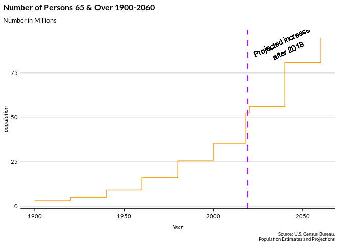

<!-- README.md is generated from README.Rmd. Please edit that file -->

# ACLOlderAmericansProfile

<!-- badges: start -->

[](https://www.tidyverse.org/lifecycle/#experimental)
<!-- badges: end -->

The goal of ACLOlderAmericansProfile is to build a Shiny Application
that highlights data from Profile of Older Americans published by the
Administration for Community Living and to submit to the Rstudio Shiny
Contest.

## Example

This is a basic example which shows you how to solve a common problem:

``` r
library(ACLOlderAmericansProfile)

persons_65_plot()
```


